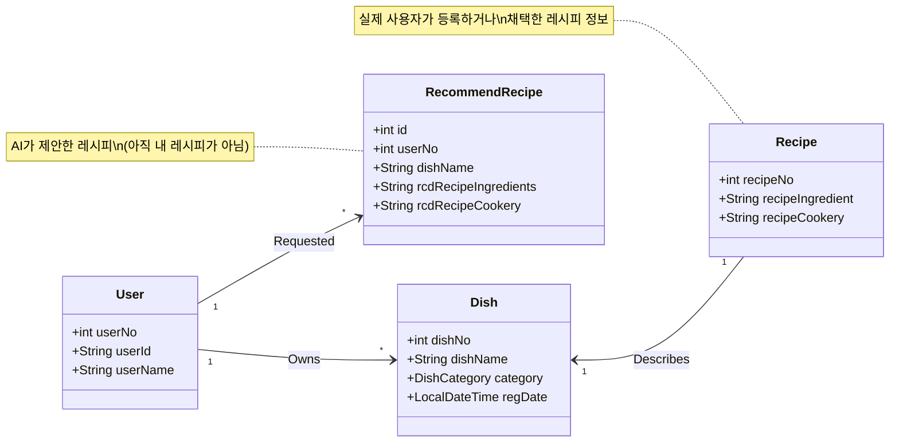
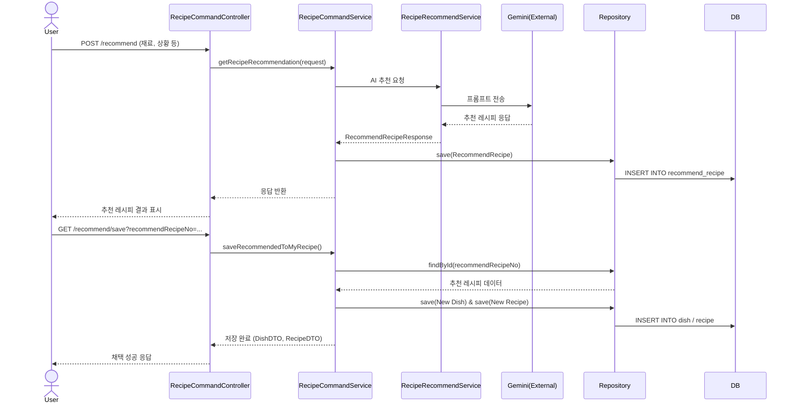

# [레시피 도메인 설명  노션 링크](https://www.notion.so/hoya-dev/Recipe-2e83eca5c5f3809db193f756915f5cb1)

# Recipe

# 클래스 간략 설명 - 패키지 구조로 구성

### Config/ModelMapperConfig.java

- `private void configureRecommendRecipeMapping(ModelMapper modelMapper)`
    
    RecommendRecipe Entity를 DTO로 변환하는 설정을 modelMapper에 추가하는 메서드
    

# command

## application

### controller

### **RecipeCommandController**

**레시피의 생성, 수정, 삭제 및 추천 기능을 담당하는 컨트롤러**

1. **registRecipe ("/api/v1/recipes")** - 레시피 신규 등록
2. **updateRecipe ("/api/v1/recipes/update")** - 레시피 정보 수정
3. **deleteRecipe ("/api/v1/recipes/delete")** - 레시피 삭제
4. **recommendRecipe ("/api/v1/recipes/recommend")** - AI를 통한 맞춤형 레시피 추천
5. **adoptRecommendedRecipe ("/api/v1/recipes/recommend/save")** - 추천된 레시피를 나의 레시피로 등록 및 저장

---

---

### **DishCommandController**

**음식(Dish)의 생성, 수정, 삭제를 담당하는 컨트롤러**

1. **registDish ("/api/v1/dishes")** - 새로운 음식 등록
2. **updateDish ("/api/v1/dishes/update")** - 음식 이름 및 카테고리 정보 수정
3. **deleteDish ("/api/v1/dishes/{dishNo}")** - 특정 고유 번호를 가진 음식 삭제

### dto

- **request**
    - **RecipeRecommendRequest**
        
        사용자 조건(재료, 숙련도, 취향 등)에 맞는 맞춤형 레시피 추천을 받기 위한 요청 객체
        
    - **RecipeUpdateRequest**
        
        기존 레시피의 식별 번호를 바탕으로 재료 목록과 조리 순서를 수정하기 위한 요청 객체
        
    - **DishUpdateRequest**
        
        특정 음식의 고유 번호를 통해 음식 이름과 카테고리 정보를 업데이트하기 위한 요청 객체
        
    - **DishCreateRequest**
        
        새로운 음식 등록을 위해 요리 이름과 해당 음식의 카테고리 정보를 전달하는 요청 객체
        
    - **RecipeCreateRequest**
        
        요리 이름, 필수 재료 리스트, 단계별 조리법을 포함하여 신규 레시피를 생성하는 요청 객체
        
- **response**
    - **AdoptRecommendedResponse**
    추천된 레시피를 사용자 레시피로 저장한 후, 생성된 레시피와 음식의 상세 정보를 반환하는 응답 객체입니다.
    - **RecommendRecipeResponse**
    추천된 요리의 이름, 카테고리, 재료, 대체 재료, 단계별 조리법 및 팁을 포함한 추천 결과를 전달하는 응답 객체입니다.
- **RecipeIngredient**
레시피 개별 재료의 이름, 수량, 단위를 관리하며 재료 리스트와 특정 포맷의 문자열 간 상호 변환 기능을 제공
- **DishCategoryEnum**
한식, 중식, 일식, 양식 등 요리의 카테고리를 체계적으로 분류하기 위해 정의된 열거형 클래스
- **CookeryUtils**
단계별 조리법 리스트를 번호가 매겨진 문자열로 변환하거나, 반대로 문자열에서 조리 순서를 추출하여 리스트로 만드는 유틸리티 클래스

### service

### **DishCommandService**

음식(Dish) 데이터의 생성, 수정, 삭제 및 추천 음식 저장 로직을 처리하는 서비스

- **saveRecommendedToMyDish**
추천된 레시피 정보를 바탕으로 새로운 음식을 등록하거나 기존 음식을 찾아 반환
- **registDish**
유저 및 카테고리 유효성을 확인한 후 새로운 음식 정보를 데이터베이스에 저장
- **updateDish**
요청한 유저의 수정 권한을 확인하고 음식의 이름이나 카테고리를 변경
- **deleteDish**
본인 확인 후 특정 음식과 그에 연결된 모든 레시피 데이터를 함께 삭제

---

### **RecipeCommandService**

레시피(Recipe)의 등록, 수정, 삭제 및 AI 추천 레시피의 관리와 저장을 담당하는 서비스

- **registRecipe**
특정 음식(Dish)에 부합하는 새로운 조리법과 재료 정보를 등록
- **updateRecipe**
기존 레시피의 재료 리스트와 단계별 조리법 내용을 수정
- **deleteRecipe**
레시피 식별 번호를 통해 해당 조리법 데이터를 삭제
- **getRecipeRecommendation**
AI 추천 서비스를 호출하여 결과를 얻고, 이를 나중에 활용할 수 있도록 추천 이력 엔티티로 저장
- **saveRecommendedToMyRecipe**
AI가 추천한 레시피 정보를 실제 사용자가 개인적으로 관리하는 레시피 데이터로 변환하여 저장

## infrastructure

## service

**RecipeRecommendService**
Spring AI의 ChatClient를 활용하여 사용자가 입력한 다양한 조건(재료, 숙련도, 취향 등)을 바탕으로 AI로부터 맞춤형 레시피 추천 정보를 생성하여 반환하는 서비스 클래스입니다.

# query

## **controller**

### **RecipeQueryController**

레시피 조회 전용 REST API 컨트롤러

1. **getAllCategories ("/api/v1/recipes/categories")**
전체 요리 카테고리 목록을 조회
2. **getMyDishes ("/api/v1/recipes/my")**
현재 로그인한 사용자가 등록한 요리 목록을 토큰 정보를 활용해 조회
3. **getDishesByUser ("/api/v1/recipes/users/{userNo}")**
특정 사용자가 등록한 요리 목록을 사용자 번호를 기반으로 조회
4. **getDishDetailsByUser ("/api/v1/recipes/users/{userNo}/details")**
특정 사용자가 등록한 요리의 상세 정보와 포함된 레시피 목록을 모두 조회
5. **getRecommendRecipesByUser ("/api/v1/recipes/recommends/users/{userNo}")**
특정 사용자의 추천 레시피 이력 목록을 조회
6. **getRecipeDetail ("/api/v1/recipes/{dishNo}")**
특정 요리의 상세 정보와 조리법(레시피) 목록을 함께 조회하며, 정보가 없을 시 404를 반환

## dto.response

**RecipeDetailResponse**
요리의 기본 정보(Dish)와 해당 요리에 포함된 모든 상세 레시피(Recipe) 목록을 함께 전달하는 상세 조회용 응답 객체

## service

### **RecipeQueryService**

**레시피 및 요리 정보 조회 로직을 처리하는 읽기 전용 서비스**

1. **findAllCategories**
데이터베이스에 등록된 모든 요리 카테고리 목록을 조회하여 반환
2. **findDishesByUserNo**
사용자 번호를 기반으로 해당 사용자가 등록한 요리 목록을 조회
3. **getRecipeDetail**
요리 번호를 통해 특정 요리의 기본 정보와 그에 연결된 모든 레시피 데이터를 함께 조회
4. **findDishesByUsername**
사용자 아이디(username)를 기반으로 해당 사용자가 소유한 요리 목록을 조회
5. **findDetailsByUser**
특정 사용자가 등록한 모든 요리에 대해 각 요리별 상세 레시피 정보를 포함한 리스트를 반환
6. **findRecommendRecipesByUser**
사용자 번호를 기반으로 해당 사용자에게 추천되었던 레시피 이력들을 조회

---

# Diagram - 이해를 돕기 위한 자료

## Class Diagram

```mermaid
classDiagram
    direction TB

    %% Controllers
    class DishCommandController:::controller
    class RecipeCommandController:::controller
    class RecipeQueryController:::controller

    %% Services
    class DishCommandService:::service
    class RecipeCommandService:::service
    class RecipeQueryService:::service
    class RecipeRecommendService:::service

    %% DTOs (Requests)
    class DishCreateRequest:::dto
    class DishUpdateRequest:::dto
    class RecipeCreateRequest:::dto
    class RecipeUpdateRequest:::dto
    class RecipeRecommendRequest:::dto

    %% DTOs (Responses)
    class AdoptRecommendedResponse:::dto
    class RecommendRecipeResponse:::dto
    class RecipeDetailResponse:::dto

    %% Others
    class DishCategoryEnum:::enum {
        <<enumeration>>
        KOREAN
        CHINESE
        JAPANESE
        WESTERN
        OTHER
    }
    class CookeryUtils:::utils
    class RecipeIngredient:::other

    %% Relationships - Controller to Service
    DishCommandController --> DishCommandService : uses
    RecipeCommandController --> RecipeCommandService : uses
    RecipeQueryController --> RecipeQueryService : uses

    %% Relationships - Service to Service
    RecipeCommandService --> DishCommandService : uses (for adoption)
    RecipeCommandService --> RecipeRecommendService : uses (for recommendation)

    %% Relationships - Service to Utils/Enum
    DishCommandService ..> DishCategoryEnum : uses
    RecipeCommandService ..> CookeryUtils : uses
    RecipeQueryService ..> CookeryUtils : uses
    RecipeRecommendService ..> CookeryUtils : uses

    %% Relationships - Controller/Service to DTOs (Dependency)
    DishCommandController ..> DishCreateRequest : accepts
    DishCommandController ..> DishUpdateRequest : accepts
    RecipeCommandController ..> RecipeCreateRequest : accepts
    RecipeCommandController ..> RecipeUpdateRequest : accepts
    RecipeCommandController ..> RecipeRecommendRequest : accepts
    RecipeCommandController ..> AdoptRecommendedResponse : returns
    RecipeCommandController ..> RecommendRecipeResponse : returns
    RecipeQueryController ..> RecipeDetailResponse : returns

    %% DTO Internal Structure (Conceptual, assuming Dish and Recipe entities exist)
    RecommendRecipeResponse *-- RecipeIngredient : contains list of
    RecipeDetailResponse *-- Dish : contains
    RecipeDetailResponse *-- Recipe : contains list of
    AdoptRecommendedResponse *-- Dish : contains
    AdoptRecommendedResponse *-- Recipe : contains

    %% Styling
    classDef controller fill:#D4E157,stroke:#333,stroke-width:2px;
    classDef service fill:#4FC3F7,stroke:#333,stroke-width:2px;
    classDef dto fill:#FFB74D,stroke:#333,stroke-width:2px;
    classDef enum fill:#90A4AE,stroke:#333,stroke-width:2px,color:white;
    classDef utils fill:#CFD8DC,stroke:#333,stroke-width:2px;
    classDef other fill:#E0E0E0,stroke:#333,stroke-width:2px;
```

---

## Entity Diagram

---

## Flow Diagram - 추천 레시피 응답 및 개인 레시피/음식 등록

---

## 전체 요약 다이어그램

```mermaid
classDiagram
    direction TB

    %% ==========================================
    %% 1. Controller Layer (요청 진입점)
    %% ==========================================
    namespace Controllers {
        class RecipeCommandController {
            +registRecipe()
            +updateRecipe()
            +recommendRecipe()
        }
        class DishCommandController {
            +registDish()
            +deleteDish()
        }
        class RecipeQueryController {
            +getAllCategories()
            +getMyDishes()
            +getRecipeDetail()
        }
    }

    %% ==========================================
    %% 2. Service Layer (비즈니스 로직)
    %% ==========================================
    namespace Services {
        class RecipeCommandService {
            +트랜잭션 관리
            +AI 추천 요청 위임
        }
        class DishCommandService {
            +요리/카테고리 관리
        }
        class RecipeQueryService {
            +조회 데이터 조립
        }
        class RecipeRecommendService {
            <<Infrastructure>>
            +OpenAI API 호출
        }
    }

    %% ==========================================
    %% 3. Repository & Mapper Layer (데이터 접근)
    %% ==========================================
    namespace Repositories_JPA {
        class RecipeRepository { <<interface>> }
        class DishRepository { <<interface>> }
        class RecommendRecipeRepository { <<interface>> }
        class DishCategoryRepository { <<interface>> }
    }

    namespace Mappers_MyBatis {
        class RecipeMapper { <<interface>> }
        class DishMapper { <<interface>> }
        class RecommendRecipeMapper { <<interface>> }
        class DishCategoryMapper { <<interface>> }
    }

    %% ==========================================
    %% 연결 관계 (Dependencies)
    %% ==========================================

    %% 1. Controller -> Service 연결
    RecipeCommandController --> RecipeCommandService
    RecipeCommandController --> DishCommandService
    DishCommandController --> DishCommandService
    RecipeQueryController --> RecipeQueryService

    %% 2. Service -> Service/Infra 연결
    RecipeCommandService --> RecipeRecommendService : AI 추천 요청

    %% 3. Service -> Repository (Command: JPA 사용)
    RecipeCommandService --> RecipeRepository
    RecipeCommandService --> DishRepository
    RecipeCommandService --> RecommendRecipeRepository
    
    DishCommandService --> DishRepository
    DishCommandService --> DishCategoryRepository

    %% 4. Service -> Mapper (Query: MyBatis 사용)
    RecipeQueryService --> RecipeMapper
    RecipeQueryService --> DishMapper
    RecipeQueryService --> RecommendRecipeMapper
    RecipeQueryService --> DishCategoryMapper

```

